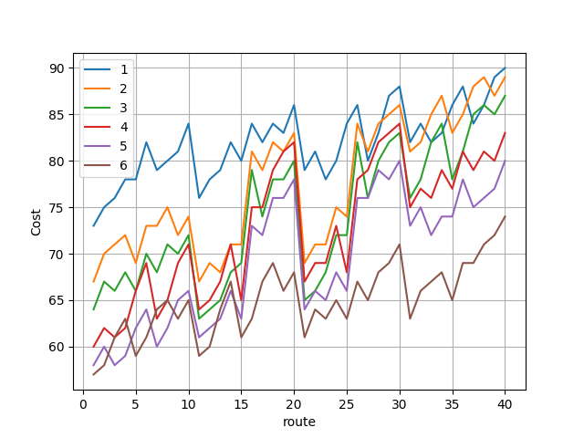
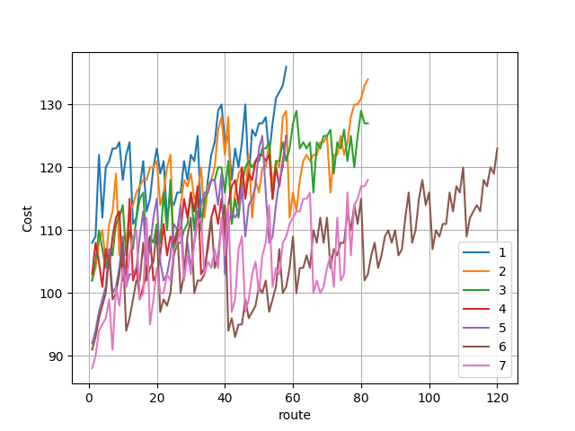
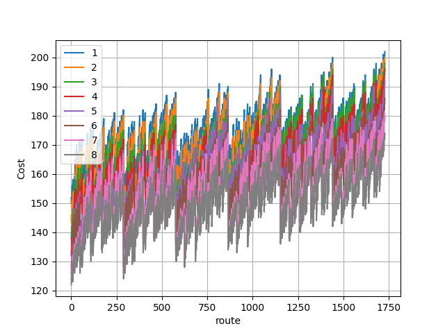
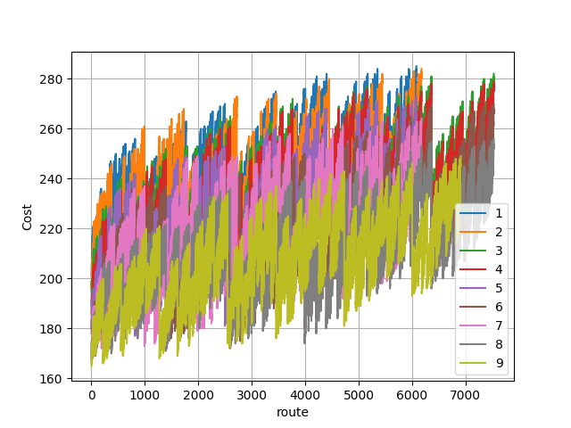
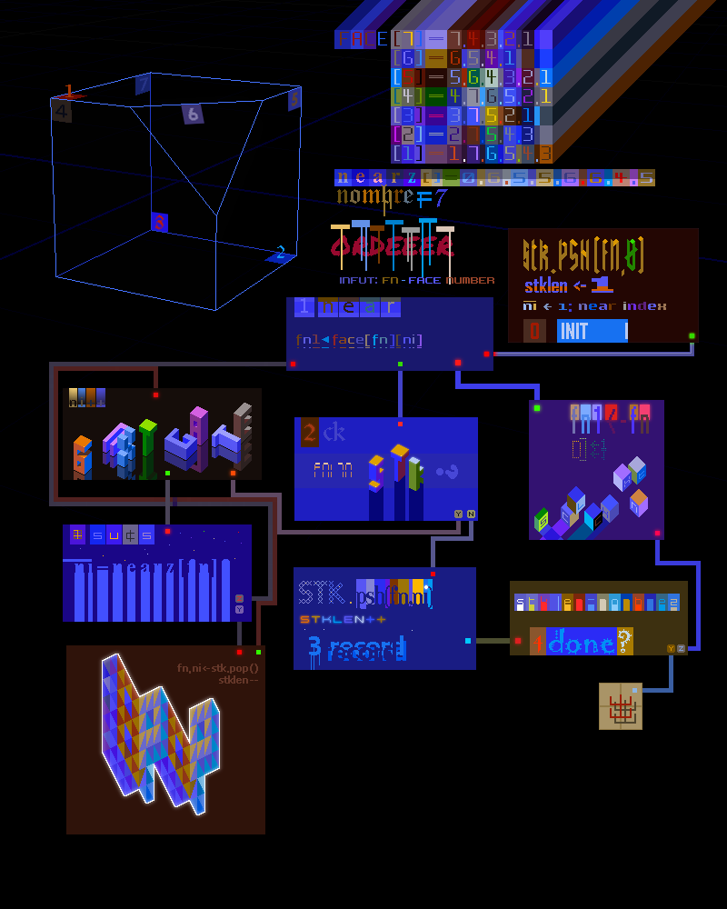
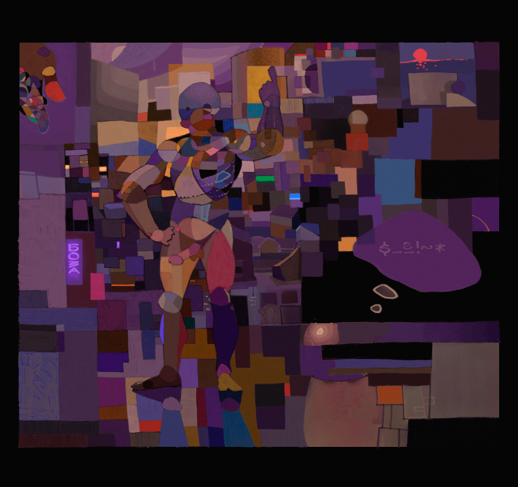
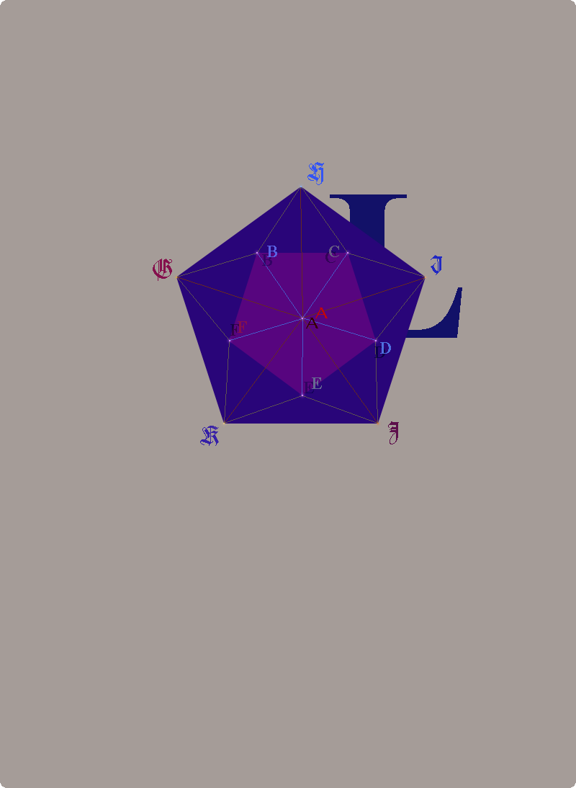
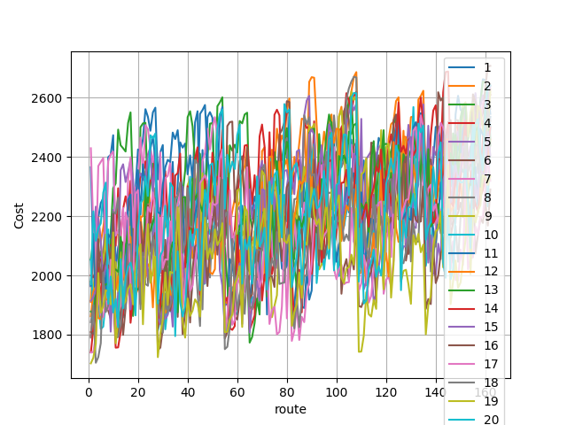

### Sah
**The** image above is from *Wikipedia* and the actual figure name is
*icosahedron*, but I'm calling that figure *Sah*, coz it sounds like *chess*.
This is 
[the sixth problem](https://ioinformatics.org/files/ioi1989problem6.pdf),
the last one from 1989.
It seems like a usual tree walk, but there is a nasty trap at **b)** bcoz
entering that forest carelessly with a simple recursive function there
is no way back, you'll just walk forever:), that is until you run out of
memory. And actually that is the problem.

Let's mark the face number visited at step *j* as *fn <sup>j</sup>*, ve vant to
minimize the following stuff:

***∑ <sub>j</sub> j fn <sup>j</sup> = (1, 2, ..., 20) · (fn <sup>1</sup>, fn <sup>2</sup>, ..., fn <sup>20</sup>)***

There are ***20!*** such permutations. This is a little bit embarrassing
but I've managed to freeze my desktop computer while trying to generate a
list with *2432902008176640000* permutations :/, I think it beeped
before dying.  Clearly the minimum possible path is *(20, 19,
..., 1)*, but it's also clear that such path might not exist. One
obvious idea is to start from this permutation and generate next
permutations **(not all!)** until we match a corresponding path. The
problem here is that the cost as a function of generated permutations
is not monotonically increasing, and not necessarily the first match
will be the path with minimum cost. So we can say OK gather first, I
don't know some large number (xu7sga) of matches and than pick the one with
minimum cost, but it looks ugly. Instead the program uses a different approach
it starts from the maximum face nombre and than at
each step it picks a neighbor from the hood with the largest face nombre,
it is very possible that it will not visit all faces from the first try but
that's why the tree search is for.

### The Hedrons
**Oköy**, the trick here is to sort in decreasing order the adjacent faces, so
the minimum path will be the first one found using inorder walk as well, so I've
made some tests with a Cube, Hepta, Octa and Ennea hedrons, while recursion
still works. Here are the corresponding results, route nombre *9*, for example,
means that this is the *9th* found path, the numbers at the legend are the
starting face numbers. Az you can see, ze minimum cost in all cases is the first
path starting from the maximum face nombre.






### Ze Alg

*Okey*, in one of the previous problems I think it was the problem with ze
book, we've mention about a non-recursive algorithm for tree search, although
it was not necessary there. The algorithm used here more or less is exactly the
same, so I've decided to make a picture of it, but it's very possible
that you'll understand nothing, so I also supplied the actual code here as well.
Now take the pencil and go through the algorithm:).

```python
################################################################
#|C|K| |S|T|K| |I|F| |T|H|E| |I|N|F|U|T| |F|A|C|E| |N|U|M|B|E|R|
#|H|A|S| |A|L|R|E|A|D|Y| |B|E|E|N| |V|I|S|I|T|E|D| | | | | | | |
def ckstk(fn1): # check check ##################################
    for fn, ni in stk: #                                       #
        if face[fn][ni] == fn1: return True #¯¯¯¯¯¯¯¯¯¯¯¯¯¯¯¯¯¯#
    return False #                           oo      ..   °°  
################################################################
#| | | | | | | | | | | | | | | | | | | | | | | | | |||||||
def ordeeer(fn): # fn - face nombre, stk should be empty here ##
    # [0. INIT] ################################################
    stk.psh((fn, 0)) # initial face number                  ® ##
    ni = 1 ########### near index                           § ##
    stklen = 1 ####### stack length       oo   ==           ¥ ##
    while True: ###############################==############### 
        # [1. NEAR] ###########################==###############
        fn1 = face[fn][ni] # fn prime      oo  ==           ‘ ##
        # [2. CK] ########################################_#####
        if not ckstk(fn1): # not visited                 _  ¢ ##
            # [3. RECORD] ##############################_#######
            stk.psh((fn, ni)) # yæ!»db«    »db«    »db«_    µ ##
            stklen += 1 # ha-ha         § &           _   ..¦ ##
            # [4. DONE?] #############################_#########
            if stklen == nombre: break # ve are don!   _    ≈ ##
            # [5. CLCKNXT] #############################_#######
            fn, ni = fn1, 1 # ·· ..                      _  № ##
            continue # jump to [1. NEAR] #################_#####
        while True: #######################################_####
            # [6. NXTGATE] ####_####_####_####_####_####_###_###
            ni += 1 #         ‘'`  ‘'`  ‘'` ==    ‘'`  ‘'`   _
            # [7. SUCKS] #__________________==µ°_______________
            if ni != nearz[fn]: break # jump to [1] ###########_
            # [8. POP] ########################################_
            fn, ni = stk.pop() #===============================_
            stklen -= 1 #--------------------------------------_
#.......0.......1.......2.......3.......4.......5.......6.......
```



Now back to the problem. Bellow is the table with face numbers
and the Sahedron top view in reversed perspective. Face *20* **(ABC)**
is surrounded with low numbers, which scenario seems to be most critical
for the algorithm, coz one might expect that the path starting from face
*19* **(JKL)** will has minimum cost.
```
  # | FACE  |  $ |  # | FACE  |  $ 
----+-------+----+----+-------+----
  1 |  ABC  | 20 | 11 |  JKL  | 19 
----+-------+----+----+-------+----
  2 |  BCH  |  1 | 12 |  EJK  | 10 
----+-------+----+----+-------+----
  3 |  CHI  |  2 | 13 |  DEJ  | 11 
----+-------+----+----+-------+----
  4 |  ACD  |  3 | 14 |  IJL  | 12 
----+-------+----+----+-------+----
  5 |  CDI  |  4 | 15 |  DIJ  | 13 
----+-------+----+----+-------+----
  6 |  ADE  |  5 | 16 |  HIL  | 14 
----+-------+----+----+-------+----
  7 |  AEF  |  6 | 17 |  GHL  | 15 
----+-------+----+----+-------+----
  8 |  ABF  |  7 | 18 |  GKL  | 16 
----+-------+----+----+-------+----
  9 |  BFG  |  8 | 19 |  FGK  | 17 
----+-------+----+----+-------+----
 10 |  BGH  |  9 | 20 |  EFK  | 18
```


Which is basically true but for the first case, but here ve can use the
recursion:



Here is the dump for the first 20 routes:
```
[19, 16, 17, 18, 10, 11, 13, 12, 14, 15, 9, 8, 7, 20, 1, 2, 4, 3, 5, 6] 1703
[19, 16, 17, 18, 10, 11, 13, 12, 14, 15, 9, 8, 7, 6, 5, 3, 20, 1, 2, 4] 1722
[19, 16, 17, 18, 10, 11, 13, 12, 14, 15, 9, 8, 7, 6, 5, 3, 4, 2, 1, 20] 1769
[19, 16, 17, 18, 10, 11, 13, 4, 2, 1, 20, 3, 5, 6, 7, 8, 9, 15, 14, 12] 2008
[19, 16, 17, 18, 10, 11, 5, 6, 7, 8, 9, 15, 14, 12, 13, 4, 3, 20, 1, 2] 1874
[19, 16, 17, 18, 10, 11, 5, 6, 7, 8, 9, 15, 14, 12, 13, 4, 2, 1, 20, 3] 1896
[19, 16, 17, 18, 10, 11, 5, 6, 7, 8, 9, 15, 14, 2, 1, 20, 3, 4, 13, 12] 1950
[19, 16, 17, 18, 10, 11, 5, 3, 20, 1, 2, 4, 13, 12, 14, 15, 9, 8, 7, 6] 1946
[19, 16, 17, 18, 6, 7, 8, 9, 15, 14, 12, 13, 4, 2, 1, 20, 3, 5, 11, 10] 1902
[19, 16, 17, 18, 6, 5, 3, 4, 2, 1, 20, 7, 8, 9, 15, 14, 12, 13, 11, 10] 2145
[19, 16, 17, 8, 9, 15, 14, 12, 13, 11, 10, 18, 6, 7, 20, 1, 2, 4, 3, 5] 1771
[19, 16, 17, 8, 9, 15, 14, 12, 13, 11, 10, 18, 6, 5, 3, 4, 2, 1, 20, 7] 1845
[19, 16, 17, 8, 9, 15, 14, 12, 13, 11, 5, 3, 4, 2, 1, 20, 7, 6, 18, 10] 1965
[19, 16, 17, 8, 9, 15, 14, 12, 13, 4, 3, 5, 11, 10, 18, 6, 7, 20, 1, 2] 1900
[19, 16, 17, 8, 9, 15, 14, 12, 13, 4, 2, 1, 20, 7, 6, 18, 10, 11, 5, 3] 1913
[19, 16, 17, 8, 9, 15, 14, 12, 13, 4, 2, 1, 20, 3, 5, 11, 10, 18, 6, 7] 1955
[19, 16, 17, 8, 9, 15, 14, 2, 1, 20, 7, 6, 18, 10, 11, 5, 3, 4, 13, 12] 1970
[19, 16, 17, 8, 7, 20, 3, 5, 6, 18, 10, 11, 13, 12, 14, 15, 9, 1, 2, 4] 1902
[19, 16, 17, 8, 7, 20, 3, 5, 6, 18, 10, 11, 13, 4, 2, 1, 9, 15, 14, 12] 2026
[19, 16, 17, 8, 7, 20, 3, 4, 2, 1, 9, 15, 14, 12, 13, 11, 10, 18, 6, 5] 2078
```

For the nasty trap here are the paths for all initial face cases:

```
[1, 20, 9, 17, 19, 18, 16, 15, 14, 13, 12, 11, 10, 6, 8, 7, 5, 4, 3, 2] 1791
[2, 20, 9, 17, 19, 18, 16, 15, 14, 13, 12, 11, 10, 6, 8, 7, 5, 4, 3, 1] 1772
[3, 20, 9, 17, 19, 18, 16, 15, 14, 13, 12, 11, 10, 6, 8, 7, 5, 4, 2, 1] 1754
[4, 20, 9, 17, 19, 18, 16, 15, 14, 13, 12, 11, 10, 6, 8, 7, 5, 3, 2, 1] 1737
[5, 20, 9, 17, 19, 18, 16, 15, 14, 13, 12, 11, 10, 6, 8, 7, 3, 4, 2, 1] 1722
[6, 20, 9, 17, 19, 18, 16, 15, 14, 13, 12, 11, 10, 5, 7, 8, 1, 4, 3, 2] 1715
[7, 20, 9, 17, 19, 18, 16, 15, 14, 13, 12, 11, 10, 6, 8, 1, 4, 5, 3, 2] 1702
[8, 20, 9, 17, 19, 18, 16, 15, 14, 13, 12, 11, 10, 6, 7, 5, 4, 3, 2, 1] 1677
[9, 20, 8, 18, 19, 17, 16, 15, 14, 13, 12, 11, 10, 6, 7, 5, 4, 3, 2, 1] 1673
[10, 19, 18, 17, 16, 15, 14, 13, 12, 11, 6, 20, 9, 8, 7, 5, 4, 3, 2, 1] 1660
[11, 19, 18, 17, 16, 15, 14, 13, 12, 10, 6, 20, 9, 8, 7, 5, 4, 3, 2, 1] 1651
[12, 19, 18, 17, 16, 15, 14, 13, 11, 10, 6, 20, 9, 8, 7, 5, 4, 3, 2, 1] 1643
[13, 19, 18, 17, 16, 15, 14, 12, 11, 10, 6, 20, 9, 8, 7, 5, 4, 3, 2, 1] 1636
[14, 19, 18, 17, 16, 15, 12, 13, 11, 10, 6, 20, 9, 8, 7, 5, 4, 3, 2, 1] 1631
[15, 19, 18, 17, 16, 14, 13, 12, 11, 10, 6, 20, 9, 8, 7, 5, 4, 3, 2, 1] 1625
[16, 19, 18, 17, 15, 14, 13, 12, 11, 10, 6, 20, 9, 8, 7, 5, 4, 3, 2, 1] 1621
[17, 19, 18, 16, 15, 14, 13, 12, 11, 10, 6, 20, 9, 8, 7, 5, 4, 3, 2, 1] 1618
[18, 19, 17, 16, 15, 14, 13, 12, 11, 10, 6, 20, 9, 8, 7, 5, 4, 3, 2, 1] 1616
[19, 18, 17, 16, 15, 14, 13, 12, 11, 10, 6, 20, 9, 8, 7, 5, 4, 3, 2, 1] 1615
[20, 9, 17, 19, 18, 16, 15, 14, 13, 12, 11, 10, 6, 8, 7, 5, 4, 3, 2, 1] 1601
```
The corresponding minimum cost path are as follows:)

```
a) JKL GKL FGK EFK BGH DEJ DIJ IJL HIL GHL BGH BFG ABF ABC BCH CHI CDI CHI ADE AEF
b) ABC,BGH,FGK,JKL,EFK,GKL,GHL,HIL,DIJ,IJL,DEJ,EJK,AEF,BFG,ABF,ADE,CDI,ACD,CHI,BCH
```
By the way I've decided that I'm going to listen only jazz.

https://youtu.be/U0Zm3NESyiI